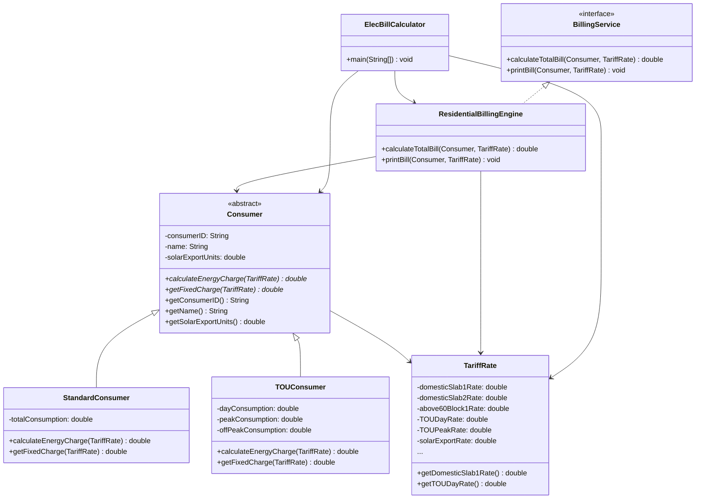

# Modern Residential Electricity Bill Calculator

A console-based Java application that calculates monthly residential electricity bills for Sri Lankan domestic consumers. The project supports **Standard Domestic** (tiered slab) and **Time-of-Use (TOU)** tariff plans, applies **solar export credits** (net metering), and prints a formatted bill summary.

Built as an **Object-Oriented Programming (OOP)** mini project for **BECS 12243** by **Group 22**.

---

## Table of Contents

- [Overview](#overview)
- [Features](#features)
- [Tariff Rates](#tariff-rates)
- [Billing Formula](#billing-formula)
- [OOP Design](#oop-design)
- [Project Structure](#project-structure)
- [Class Architecture](#class-architecture)
- [Getting Started](#getting-started)
- [How to Run](#how-to-run)
- [Usage Example](#usage-example)
- [Calculation Details](#calculation-details)
- [Team & Contributions](#team--contributions)
- [References](#references)
- [Future Enhancements](#future-enhancements)

---

## Overview

Electricity tariffs in Sri Lanka use complex multi-tier slabs and time-based rates (effective from **15 October 2025**, per the Public Utilities Commission of Sri Lanka). Many consumers find it difficult to estimate their monthly bill, especially when combining:

- Tiered consumption slabs (0–30, 31–60, and above 60 kWh)
- Time-of-Use (Day, Peak, Off-Peak) pricing
- Solar energy exported back to the grid (net metering credits)

This application automates those calculations and produces a clear, itemized bill breakdown in Sri Lankan Rupees (LKR).

---

## Features

| Feature | Description |
|---------|-------------|
| **Standard Domestic Billing** | Tiered slab energy charges for total monthly consumption |
| **TOU Billing** | Separate rates for Day, Peak, and Off-Peak consumption |
| **Solar Credit** | Deducts credits for exported solar units (kWh) |
| **Fixed Charges** | Applies the correct monthly fixed charge per tariff type |
| **Formatted Bill Output** | Prints energy charge, fixed charge, solar credit, and net payable amount |
| **Extensible OOP Design** | Abstract `Consumer` base class allows adding new consumer categories later |

---

## Tariff Rates

Rates are defined in `TariffRate.java` and are based on the **approved domestic tariff table** (Annex-2, Public Utilities Commission of Sri Lanka, effective 15 October 2025). See `Annex-2-Approved-Tariff-Table.jpg` in the repository root for the official reference.

### Standard Domestic

| Consumption Range | Energy Rate (LKR/kWh) |
|-------------------|----------------------|
| 0 – 30 kWh | 4.50 |
| 31 – 60 kWh | 8.00 |

**When total consumption exceeds 60 kWh**, the above-60 block rates apply:

| Block | Units | Energy Rate (LKR/kWh) |
|-------|-------|----------------------|
| Block 1 | First 60 kWh | 12.75 |
| Block 2 | Next 30 kWh (61–90) | 18.50 |
| Block 3 | Above 90 kWh | 24.00 |

| Fixed Charge | Condition | Amount (LKR/month) |
|--------------|-----------|-------------------|
| Tier 1 | Consumption ≤ 30 kWh | 80.00 |
| Tier 2 | Consumption > 30 kWh | 210.00 |

### Time-of-Use (TOU) Domestic

| Period | Time Window | Energy Rate (LKR/kWh) |
|--------|-------------|----------------------|
| Day | 05:30 – 18:30 | 35.00 |
| Peak | 18:30 – 22:30 | 67.00 |
| Off-Peak | 22:30 – 05:30 | 21.00 |

| Fixed Charge | Amount (LKR/month) |
|--------------|-------------------|
| TOU Fixed | 2,100.00 |

### Solar Export (Net Metering)

| Rate | Value |
|------|-------|
| Solar export credit | 25.00 LKR/kWh |

---

## Billing Formula

```
Net Payable Amount = (Energy Charge + Fixed Charge) − Solar Credit
```

Where:

- **Energy Charge** — calculated by the consumer subclass (`StandardConsumer` or `TOUConsumer`)
- **Fixed Charge** — monthly flat fee based on tariff type and consumption
- **Solar Credit** — `solarExportUnits × 25.00`

---

## OOP Design

This project demonstrates core Object-Oriented Programming principles:

| Principle | Implementation |
|-----------|----------------|
| **Encapsulation** | Tariff rates and consumer data are stored in private fields with controlled access via getters |
| **Abstraction** | `Consumer` is an abstract class; `BillingService` is an interface defining the billing contract |
| **Inheritance** | `StandardConsumer` and `TOUConsumer` extend `Consumer` and override billing methods |
| **Polymorphism** | `ResidentialBillingEngine` calls `calculateEnergyCharge()` and `getFixedCharge()` on a `Consumer` reference; the correct subclass logic runs at runtime |
| **Separation of Concerns** | Rates (`TariffRate`), consumer logic (`Consumer` subclasses), and billing orchestration (`ResidentialBillingEngine`) are in separate classes |

---

## Project Structure

```
OOP-Project-2ndSem/
├── README.md                              # This file
├── Annex-2-Approved-Tariff-Table.jpg      # Official PUCSL tariff reference
├── Project Report.docx                    # Full academic project report
└── OOP Mini Project/
    ├── src/
    │   ├── ElecBillCalculator.java        # Main entry point (console UI)
    │   ├── TariffRate.java                # Encapsulated tariff rate data
    │   ├── Consumer.java                  # Abstract base consumer class
    │   ├── StandardConsumer.java          # Standard domestic slab billing
    │   ├── TOUConsumer.java               # Time-of-Use billing
    │   ├── BillingService.java            # Billing interface
    │   └── ResidentialBillingEngine.java  # Bill calculation & printing engine
    ├── out/                               # Compiled .class files (generated)
    └── .idea/                             # IntelliJ IDEA project configuration
```

---

## Class Architecture



### Class Responsibilities

| Class / Interface | Role |
|-------------------|------|
| `ElecBillCalculator` | Main class; handles user input via `Scanner` and drives the application |
| `TariffRate` | Stores all LKR/kWh and fixed charge rates; single point of update when tariffs change |
| `Consumer` | Abstract base holding shared consumer data and defining billing method contracts |
| `StandardConsumer` | Implements tiered slab energy charge and consumption-based fixed charge logic |
| `TOUConsumer` | Implements time-period energy charge and flat TOU fixed charge logic |
| `BillingService` | Interface defining `calculateTotalBill()` and `printBill()` |
| `ResidentialBillingEngine` | Core engine that aggregates charges, applies solar credit, and prints the bill |

---

## Getting Started

### Prerequisites

- **Java Development Kit (JDK) 21** or later
- Any Java IDE (IntelliJ IDEA recommended — project is pre-configured) or a terminal with `javac` and `java`

---

## How to Run

### Option 1: IntelliJ IDEA

1. Open the `OOP Mini Project` folder in IntelliJ IDEA.
2. Ensure the project SDK is set to **JDK 21** (configured in `.idea/misc.xml`).
3. Open `src/ElecBillCalculator.java`.
4. Right-click and select **Run 'ElecBillCalculator.main()'**.

### Option 2: Command Line

From the `OOP Mini Project` directory:

```bash
# Compile all source files
javac -d out src/*.java

# Run the application
java -cp out ElecBillCalculator
```

---

## Usage Example

### Standard Domestic Consumer

```
--- Team 22 Electricity Bill Calculator ---
Enter Consumer Name: Kamal Perera
Enter Consumer ID: DOM-001
Enter Solar Export Units (kWh) (0 if none): 10

Select Tariff Plan:
1. Standard Domestic
2. Time-of-Use (TOU)
Choice: 1
Enter Total Monthly Consumption (kWh): 75

========= MONTHLY ELECTRICITY BILL =========
Consumer: Kamal Perera (DOM-001)
Tariff Type: Standard Domestic
--------------------------------------------
Energy Charge:         Rs.    1042.50
Fixed Charge:          Rs.     210.00
Solar Credit:         -Rs.     250.00
--------------------------------------------
NET PAYABLE AMOUNT:    Rs.    1002.50
============================================
```

**How the energy charge is computed for 75 kWh (above 60):**

- Block 1: 60 kWh × Rs. 12.75 = Rs. 765.00
- Block 2: 15 kWh × Rs. 18.50 = Rs. 277.50
- **Total energy charge = Rs. 1,042.50**

### Time-of-Use (TOU) Consumer

```
--- Team 22 Electricity Bill Calculator ---
Enter Consumer Name: Nimal Silva
Enter Consumer ID: TOU-002
Enter Solar Export Units (kWh) (0 if none): 0

Select Tariff Plan:
1. Standard Domestic
2. Time-of-Use (TOU)
Choice: 2
Enter Day Consumption (kWh): 120
Enter Peak Consumption (kWh): 40
Enter Off-Peak Consumption (kWh): 80

========= MONTHLY ELECTRICITY BILL =========
Consumer: Nimal Silva (TOU-002)
Tariff Type: Time-of-Use (TOU)
--------------------------------------------
Energy Charge:         Rs.    8380.00
Fixed Charge:          Rs.    2100.00
Solar Credit:         -Rs.       0.00
--------------------------------------------
NET PAYABLE AMOUNT:    Rs.   10480.00
============================================
```

**How the energy charge is computed:**

- Day:   120 kWh × Rs. 35.00 = Rs. 4,200.00
- Peak:   40 kWh × Rs. 67.00 = Rs. 2,680.00
- Off-Peak: 80 kWh × Rs. 21.00 = Rs. 1,680.00
- **Total energy charge = Rs. 8,380.00**

---

## Calculation Details

### Standard Domestic — Energy Charge Logic

```
If consumption ≤ 60 kWh:
    If ≤ 30 kWh  → units × Rs. 4.50
    If 31–60 kWh → (30 × Rs. 4.50) + ((units − 30) × Rs. 8.00)

If consumption > 60 kWh:
    If 61–90 kWh → (60 × Rs. 12.75) + ((units − 60) × Rs. 18.50)
    If > 90 kWh  → (60 × Rs. 12.75) + (30 × Rs. 18.50) + ((units − 90) × Rs. 24.00)
```

### Standard Domestic — Fixed Charge Logic

```
If total consumption ≤ 30 kWh → Rs. 80.00
Otherwise                     → Rs. 210.00
```

### TOU — Energy Charge Logic

```
(Day kWh × Rs. 35.00) + (Peak kWh × Rs. 67.00) + (Off-Peak kWh × Rs. 21.00)
```

### TOU — Fixed Charge

```
Flat Rs. 2,100.00 per month
```

### Solar Credit

```
Solar Credit = solarExportUnits × Rs. 25.00
```

---

## Team & Contributions

**Group Number:** 22  
**Course:** BECS 12243 — Object-Oriented Programming

| Student Number | Name | Contribution |
|----------------|------|--------------|
| EC/2023/071 | K. L. S. D. Fernando | `ElecBillCalculator.java` |
| EC/2023/044 | W. P. J. Prabhashwara | `Consumer.java`, `TOUConsumer.java` |
| EC/2023/078 | M. A. M. Deepal | `TariffRate.java` |
| EC/2023/014 | D. D. S. V. De Alwis | `StandardConsumer.java` |
| EC/2023/037 | E. K. N. S. Ekanayake | `BillingService.java`, `ResidentialBillingEngine.java` |

---

## References

- **Public Utilities Commission of Sri Lanka** — Approved Tariff Table (Annex-2), effective 15 October 2025  
  → See `Annex-2-Approved-Tariff-Table.jpg` in this repository
- **Project Report** — `Project Report.docx` (full academic documentation)

---

## Future Enhancements

The current design is intentionally scoped to **residential domestic** billing. The abstract `Consumer` class makes the following extensions straightforward:

- [ ] Religious & Charitable institution tariff category
- [ ] Industrial, Hotel, and General Purpose consumer types
- [ ] Pre-paid tariff scheme support
- [ ] Graphical user interface (GUI) or web-based frontend
- [ ] Bill history storage (file or database persistence)
- [ ] Input validation and error handling for invalid consumption values
- [ ] Support for additional above-60 blocks (91–120, 121–180, above 180 kWh) per the full Annex-2 table

---

## Repository

**GitHub:** [https://github.com/klsdfernando/OOP-Project-2ndSem](https://github.com/klsdfernando/OOP-Project-2ndSem)

---

## License

This project was developed as an academic assignment. All rights reserved by Group 22, BECS 12243.
